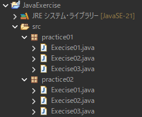

# Javaの練習問題

## 練習問題の進め方

練習問題のほとんどはProgateの範囲内の内容です  
一部 Progate外の内容も含まれていますが、Javaのプログラムでは必須の内容ですので、Webなどで調べながら進めてください

またProgateの内容を単純に使うだけでは難しい問題もあります  
ProgateはJava言語の「書き方」の学習が主要素ですが、練習問題では「処理の流れを考える」練習が主要素になっています  
Progateの内容をどのように組み合わせるか、考えながら取り組んでください

## eclipse
練習問題ではJavaの統合開発環境 eclipse(Pleiades) を使用します  
PCにインストールされていない場合は https://willbrains.jp/ よりダウンロードしてください

## eclipseの「プロジェクト」
eclipseでは「プロジェクト」という単位で関連するソースを1つにまとめて管理します  
まずは練習問題用のJavaプロジェクトを作成してください  
プロジェクトの作り方は「3ステップ Java入門」書籍を参考にするか、Webなどで調べてください

## Javaの「パッケージ」
練習問題ごとに「パッケージ」を作成して、ソースをまとめるようにしましょう  
パッケージについてはWebなどで調べてください  
また必要に応じてサブパッケージも使用しましょう

## ソースの分け方
練習問題の設問ごとにソース(クラス)を分けましょう
クラスは**単一責任の原則**で考えることが基本です

## 構成例

